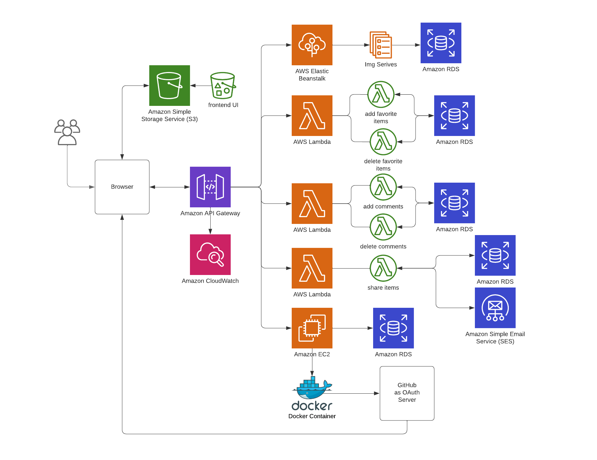

# 6156_22Fall: Online Art Museum
COMS E6156 Cloud Computing 22 Fall at CU   
   
An Online Art Museum that support liking and commenting images, as well as
sharing the image through email.

## Structure

## Components
### S3 bucket
Store media and html files for front end.   

### OAuth Server
Use GitHub as the Authorization Server to generate access_token.   
The server is ran in docker container in an EC2 instance.   

### API Gateway
Connect query paths with underlying lambda functions.   

### AWS Lambda
Implemented PUT, GET, and DELETE for like and comment, respectively, 
and SES support as well.   

### Amazon RDS
Used to store user information, images, likes and comments.

